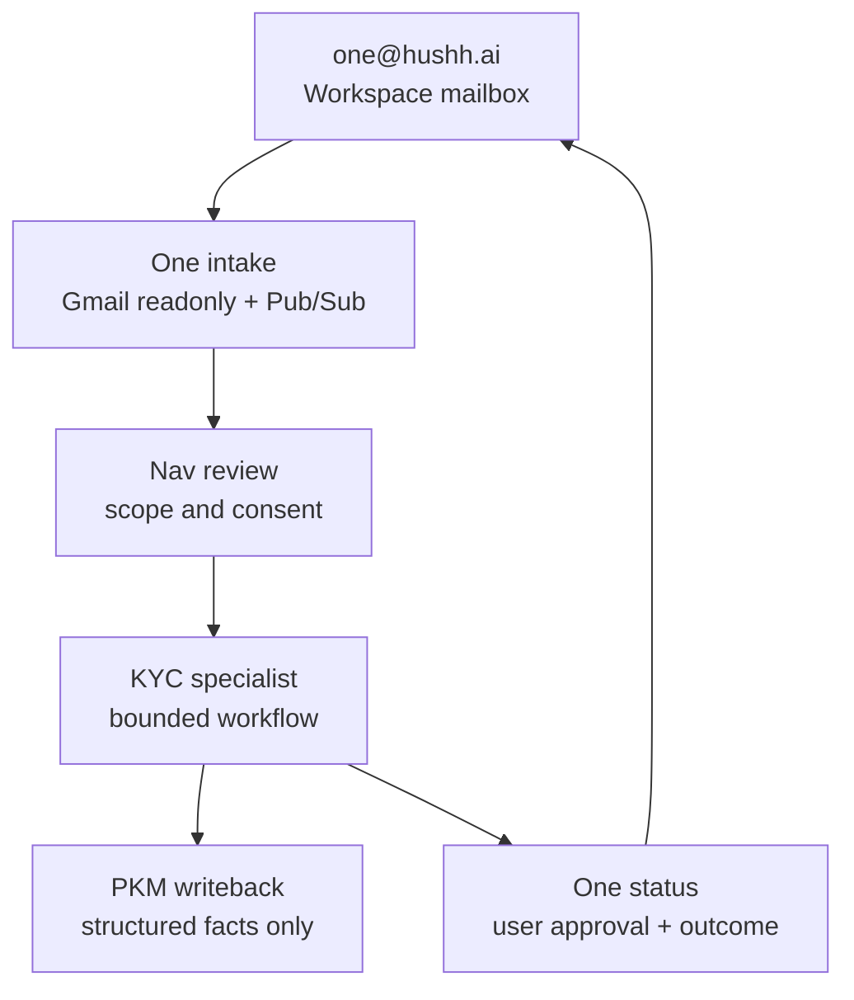

# One Email Intake Roadmap

Status: V1 UAT implementation is live for One mailbox intake, workflow state, scoped consent requests, `/one/kyc`, Gmail watch renewal, value-filled KYC draft generation, text/voice redraft, and approval-gated Gmail send. Production/public automation is not current-state until the UAT learnings are promoted through the production rollout gate. The current backend decrypts approved scoped exports in memory and stores user-reviewable drafts as sensitive workflow state with short-retention requirements; that is encrypted export governance, not strict backend-never-sees-plaintext ZK.

## Visual Map

## Summary

`one@hushh.ai` is the canonical mailbox identity for One-led email workflows. It should feel seamless to users and counterparties, but the runtime must stay explicit about authority:

- One owns the relationship and user-facing status.
- Nav owns scope review, consent language, revocation, and trust explanations.
- KYC owns delegated identity/KYC workflow execution only after One and Nav establish authority.
- PKM stores only structured durable facts and artifacts, not raw mailbox threads.

The canonical Workspace domain-wide delegation client is `109021324828349644970`, backed by the `hushh-pda` Firebase Admin service account. The required initial Gmail scopes are:

- `https://www.googleapis.com/auth/gmail.readonly`
- `https://www.googleapis.com/auth/gmail.send`

`gmail.settings.basic` is not required for the first One intake path.

## Current Repo State

What exists:

- user-consented Gmail receipts through `GMAIL_OAUTH_*`
- Gmail send for support and RIA invite email through Workspace delegation
- Firebase Admin credential loading for backend auth/admin work
- One/Kai/Nav/KYC agent ontology and planning docs
- PKM and consent surfaces that can receive structured workflow outcomes
- One mailbox webhook route: `POST /api/one/email/webhook`
- One mailbox watch renewal route: `POST /api/one/email/watch/renew`
- KYC workflow routes under `/api/one/kyc/workflows`
- app review/status surface: `/one/kyc`
- metadata-only workflow tables from `049_one_email_kyc_workflows.sql`

What is standardized now:

- `FIREBASE_ADMIN_CREDENTIALS_JSON` remains the canonical backend service-account secret.
- `FIREBASE_SERVICE_ACCOUNT_JSON` is accepted as a runtime alias for environments that already mount it.
- Workspace Gmail send defaults to `one@hushh.ai` as the delegated real mailbox unless a specific `SUPPORT_EMAIL_DELEGATED_USER` override is set.
- `GMAIL_OAUTH_*` remains user Gmail receipts OAuth only; it is not the One mailbox path.

UAT hosted state as of 2026-05-03:

- migration `049_one_email_kyc_workflows.sql` is applied and verified by the UAT DB contract guard.
- Gmail watch renewal is active for `one@hushh.ai`.
- Pub/Sub push intake is configured for the One mailbox UAT topic/subscription. The active UAT Gmail topic lives in `hushh-pda`, matching the delegated Gmail client project; the UAT Scheduler/runtime still live in `hushh-pda-uat`.
- `ONE_EMAIL_KYC_CONNECTOR_PUBLIC_KEY` and `ONE_EMAIL_KYC_CONNECTOR_KEY_ID` are configured for UAT.
- `ONE_EMAIL_KYC_CONNECTOR_PRIVATE_KEY` is available in Secret Manager for value-filled UAT KYC drafting; the private key is used only for in-memory decrypt of approved scoped exports.
- a real broker-style UAT email smoke created a KYC workflow, requested scoped consent, accepted user approval, decrypted the approved scoped export, generated a value-filled review draft, redrafted through the voice/text action path, and sent the approved reply from `one@hushh.ai`.
- the visible sender display name for this lane is `One <one@hushh.ai>`.
- UAT proof artifact: smoke id `one-kyc-smoke-20260503074743`, workflow id `47bc44d76dc045b9b093d69a87325af2`.

What still needs production/product rollout:

- promote the UAT Pub/Sub/Scheduler/env setup to production only after an explicit production gate.
- decide the production mailbox-watch ownership model before enabling production renewal against the same `one@hushh.ai` mailbox.
- write structured completion state back to PKM after user-approved send.
- add the retention job that redacts or purges terminal `draft_body` after 30 days.
- add encrypted-at-rest draft storage before treating KYC drafts as production-grade sensitive workflow state.

## Seamless User Story

1. A counterparty emails or CCs `one@hushh.ai`.
2. The One mailbox intake receives a Gmail push notification.
3. The backend fetches only the needed message metadata/body using delegated readonly scope.
4. One classifies whether the email belongs to a known user and known workflow.
5. If the task needs access to user PKM, vault state, documents, or outbound authority, One asks Nav to request narrow consent.
6. KYC executes only the bounded workflow after consent exists.
7. KYC writes structured workflow state and approved facts back to PKM.
8. One shows status to the user: needs scope, needs documents, drafting, waiting on user, waiting on counterparty, completed, or blocked.
9. Any sensitive outbound response is user-approved before send.

## Runtime Roadmap

### Phase 1: Credential And Config Contract

- Use service account client `109021324828349644970`.
- Keep one service-account credential source for maintained backend runtime.
- Use `ONE_EMAIL_ADDRESS=one@hushh.ai` as the mailbox identity.
- Keep the visible KYC sender display fixed to `One`.
- Keep `SUPPORT_EMAIL_*` for support/invite overrides only.
- Keep user Gmail receipts on `GMAIL_OAUTH_*`.
- Do not reuse old `hushone-app` Gmail ingestion services for this path.

### Phase 2: One Mailbox Intake

- Use backend route `POST /api/one/email/webhook`.
- Verify Pub/Sub push tokens or signed headers before processing.
- Fetch messages with Gmail readonly scope under subject `one@hushh.ai`.
- Persist only message IDs, thread IDs, sender metadata, normalized classification, required-field labels, and workflow state.
- Do not persist raw full email threads as durable PKM memory.

### Phase 3: Watch Renewal And Replay Safety

- Create a Gmail `users.watch` registration for `one@hushh.ai`.
- Renew before expiration through Cloud Scheduler or an authenticated maintenance job.
- Store watch expiration and last processed `historyId`.
- Deduplicate by Gmail message/thread/history IDs.
- Treat gaps or expired history cursors as blocked/recovery state, not silent success.
- Do not let UAT and production independently renew watches for the same `one@hushh.ai` mailbox. Production rollout must either move watch ownership to production, keep UAT disabled, use an explicitly managed label/topic strategy, or introduce a single fanout controller.

Google's [Gmail push documentation](https://developers.google.com/workspace/gmail/api/guides/push) requires `watch` renewal at least once every seven days and recommends daily renewal. The [`users.watch` reference](https://developers.google.com/workspace/gmail/api/reference/rest/v1/users/watch) includes an `expiration` timestamp, so the runtime gate should verify both `watch_status=active` and a safe future expiration before production promotion.

### Phase 4: One/Nav/KYC Workflow

- Add KYC workflow states: `needs_scope`, `needs_documents`, `drafting`, `waiting_on_user`, `waiting_on_counterparty`, `completed`, `blocked`.
- Add consent scopes such as `agent.one.orchestrate`, `agent.nav.review`, `agent.kyc.process`, and `agent.kyc.writeback`.
- KYC reads/writes only inside the workflow consent grant.
- Outbound KYC messages default to approval-required.

### Phase 5: Product UX

- Use the One inbox/workflow surface at `/one/kyc`.
- Show trust state, current blocker, next action, and audit receipt.
- Route finance-specific tasks to Kai only when the task becomes financial advice, portfolio analysis, or RIA workflow.
- Keep KYC visible only when a KYC workflow is active; One stays the top agent.

### Phase 6: UAT And Production Rollout

- UAT uses the real `one@hushh.ai` mailbox and real delegated Gmail calls.
- UAT smoke uses controlled test emails instead of fabricated events.
- Production remains untouched until the production rollout gate confirms no leakage from UAT tests.
- Promote to production only after intake, dedupe, consent, PKM writeback, value-filled draft generation, and approval-gated send are tested end to end.

### Phase 7: Draft Storage ZK Hardening

- Current V1 stores the user-reviewable `draft_body` in `one_kyc_workflows` as sensitive workflow state so the user can review and approve before send.
- This is not strict ZK. The One backend decrypts approved scoped exports in memory, maps the approved values into a draft, and persists the reviewable draft until send/reject/retention cleanup.
- Smallest production-grade improvement: add an additive migration with draft ciphertext, IV, tag, algorithm, and key id columns; encrypt drafts at rest with a dedicated One KYC draft-storage key; decrypt only for user review, redraft, and approval-gated send; then null legacy plaintext.
- Strict backend-never-sees-plaintext ZK requires a broader V2: draft generation/storage moves to the client or to a user-held key path, and Gmail send receives plaintext only transiently at approval time.
- Until encrypted draft storage ships, terminal drafts must be redacted or purged after 30 days and active waiting-on-user drafts must be monitored as sensitive workflow state.

## Acceptance Gates

- Delegated token works for `one@hushh.ai` with `gmail.readonly` and `gmail.send`.
- Backend support/invite send can use the canonical credential without a second service account.
- One mailbox intake rejects unauthenticated Pub/Sub calls.
- Intake deduplicates Gmail events.
- Workflow state is inspectable without reading raw email bodies.
- KYC cannot read/write outside its granted workflow scope.
- Outbound sensitive messages require user approval.
- Production One mailbox automation has one active watch owner and a daily renewal job.
- `one_email_mailbox_state.watch_status` is active and `watch_expiration_at` is safely in the future before promotion.
- KYC drafts are either encrypted at rest or explicitly blocked from production/public launch with retention redaction enabled.
- Current-state docs do not claim production/public One email automation until the production gate passes.

## Non-Goals

- No broad standing mailbox agent.
- No use of Google Workspace migration clients.
- No dependency on old `hushone-app` Gmail ingestion.
- No calendar scope in the first One email rollout.
- No raw email threads, tokens, chain-of-thought, or broad decrypted context as durable PKM memory.
